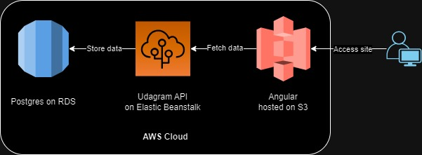

# Infractructure description

## Description
We use AWS cloud services to host application:
 - RDS run the postgres database.
 - Elastic Beanstalk hosts the application API.
 - S3 hosts the front end side.
