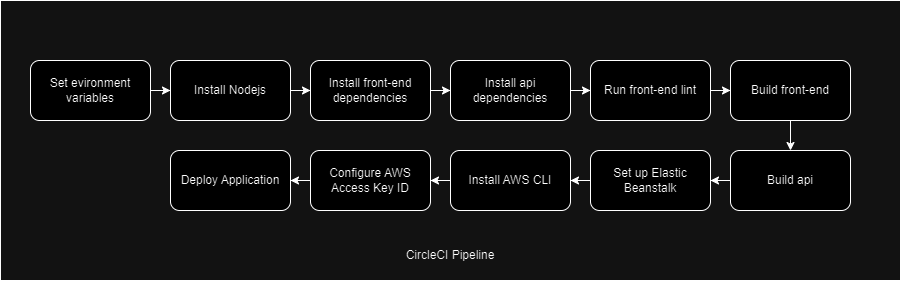

# Pipeline description

## Description
When developer push new changes to repository CircleCI will do the below steps:
 - Setting the environment variables for AWS Configure, front-end side, api.
 - Install Nodejs for install front-end, api dependencies.
 - Install front-end dependencies.
 - Install api dependencies.
 - Run front-end to check code format.
 - Build front-end build folder.
 - Build api build folder.
 - Setting up the Elastic Beanstalk for API deployment.
 - Install AWS CLI.
 - Configure AWS access key ID.
 - Deploy API, Front-end.
